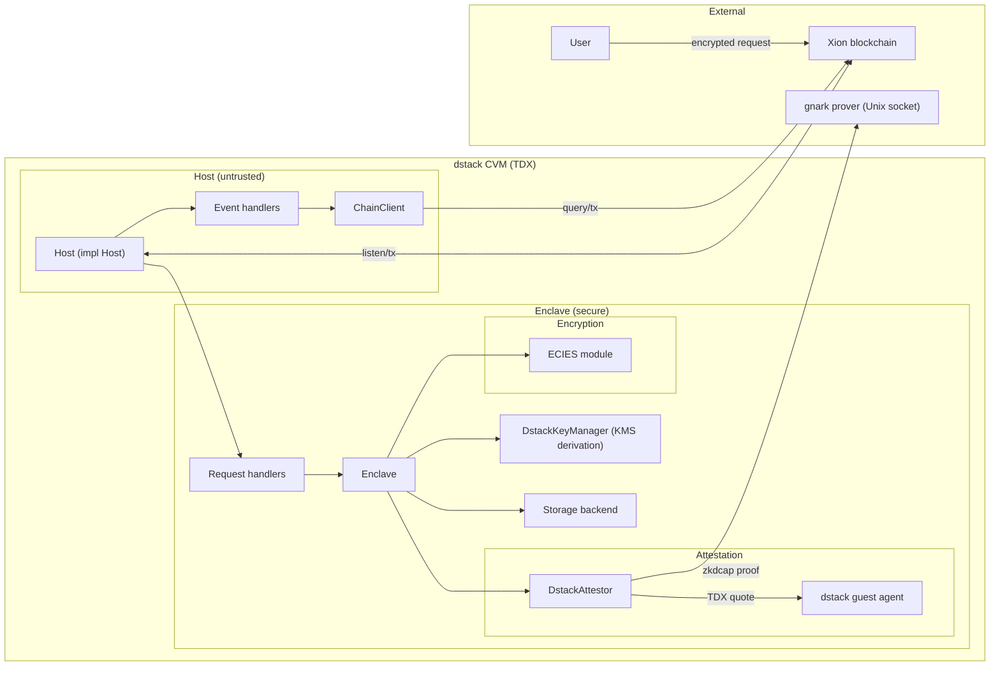

# Building Applications

Quartz is a framework for building private applications using TEEs.
It allows app devs to establish secure communication with TEEs
and to manage what code runs on what data, and when.

---
WARNING:

Quartz provides utilities for secure communication with TEEs,
but it DOES NOT specify a data model for applications. App devs must remain
diligent to ensure their data model does not leak private information.

---

With Quartz, app devs write code for two environments: smart contracts and TEEs.

- Smart contract code: CosmWasm 3 Rust, deployed on Xion.
- TEE code: Rust, running in a standard Docker container on a dstack CVM (TDX).

App devs design their smart contracts and enclave code in tandem.
Enclave code is not restricted to CosmWasm -- it can be arbitrary Rust.

See the [transfers app](/examples/transfers) for an example.

For background on the handshake protocol, see [How it Works](/docs/how_it_works.md).
The formal spec is at [`specs/handshake.qnt`](/specs/handshake.qnt).

## System Component Diagram

## Smart Contract Code

A Quartz smart contract must specify:

- how private requests are queued for TEE execution
- how private state is managed
- how TEE responses (public and private) are executed
- how TEE operators are managed and authorized

Attestation verification is done via the Xion ZK module (direct gRPC query).
No separate `dcap-verifier` or `tcbinfo` contracts are needed. The contract
stores a `zkdcap_vkey` for Groth16 proof verification.

Use `quartz-contract-core` for message types and handlers. See the
[contract core README](/crates/contracts/core/README.md).

## Enclave Code

A Quartz enclave listens for blockchain events and processes encrypted requests.
Key components:

- **`DstackAttestor`** -- TDX attestations via dstack guest agent socket.
- **`DstackKeyManager`** -- Deterministic key derivation via dstack KMS.
- **ECIES module** -- Encrypt/decrypt communication with the contract.
- **Light client proofs** -- Verify contract state before processing.

For details, see the [enclave core README](/crates/enclave/core/README.md).

Integration tests using `cw_multi_test` with a ZK module mock are at
[`tests/integration/`](/tests/integration/).
