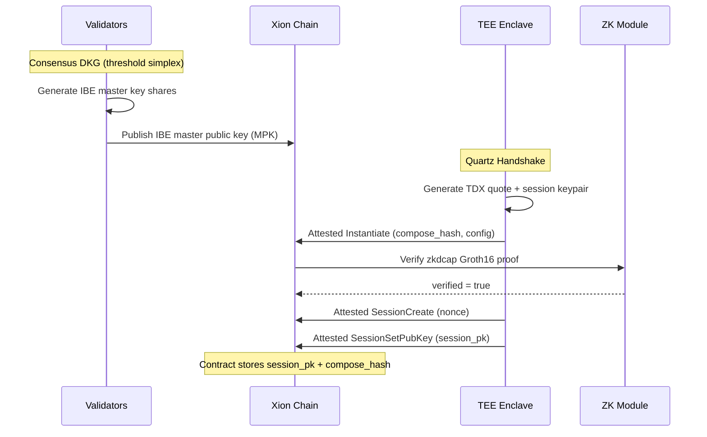
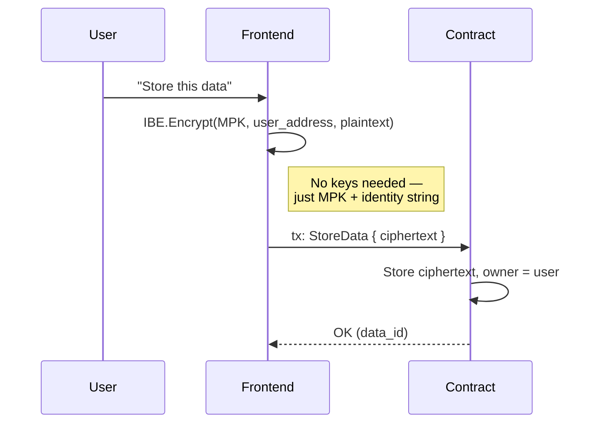
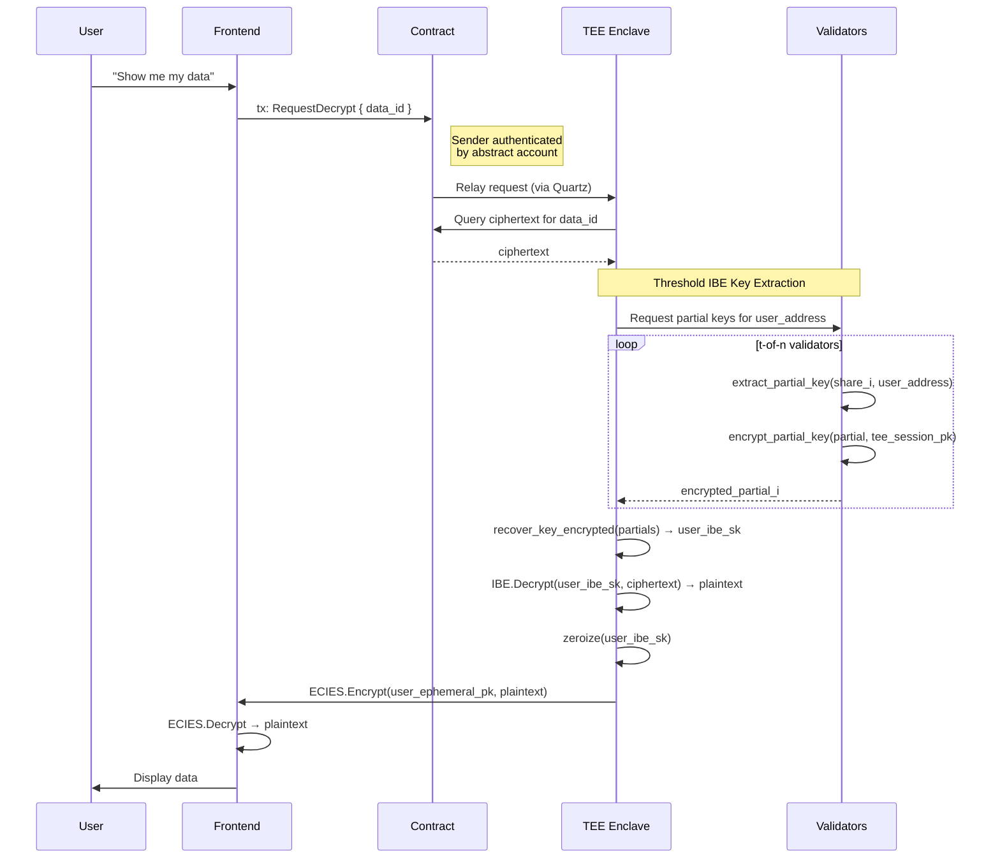
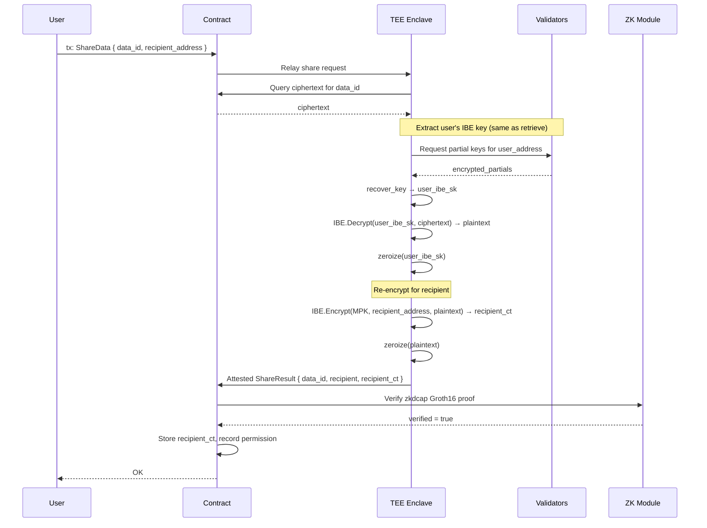
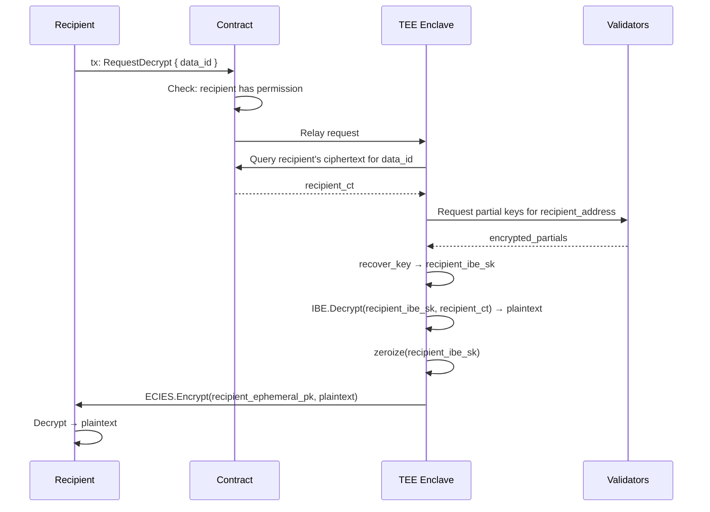
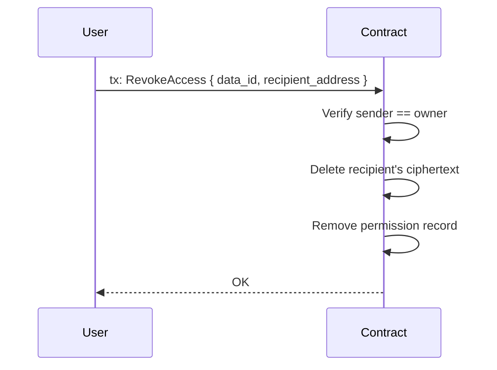
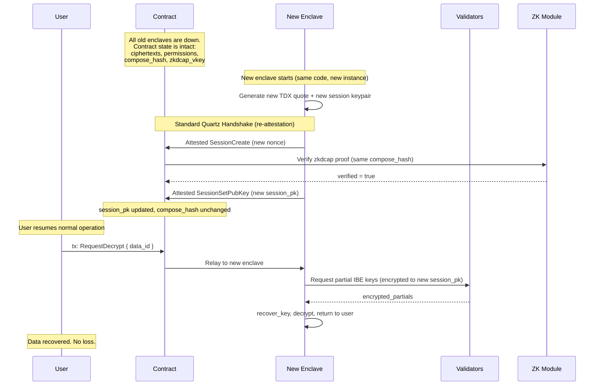

# Private On-Chain Data: Full Control Flow

## Parties

| Party | Role | Trust Basis |
|-------|------|-------------|
| **User** | Data owner, Xion abstract account | Authenticated by chain (email, social, biometric, passkey) |
| **Recipient** | Granted access by User | Authenticated by chain |
| **Contract** | CosmWasm on Xion, stores ciphertexts + permissions | On-chain, deterministic, auditable |
| **TEE Enclave** | Quartz dstack CVM (Intel TDX), processes plaintext | Hardware attestation (TDX quote → zkdcap proof) |
| **Validators** | Commonware threshold simplex, hold IBE master shares | Threshold trust — no single validator sees full key |
| **ZK Module** | Xion native module, verifies Groth16 proofs | Chain-native, all validators execute |

## Why No Per-User Key Management?

IBE (Identity-Based Encryption) lets anyone encrypt data **to an identity string**
(e.g. a Xion address) using only the **public master key**. No recipient key exchange,
no seed phrases, no key servers. The validators collectively extract decryption keys
on demand — but only deliver them inside the attested TEE.

---

## System Setup (once)



After setup, the chain knows:
- **MPK**: anyone can encrypt to any identity
- **session_pk**: the TEE's public key for secure communication
- **compose_hash**: the TEE's verified code identity

---

## 1. Store Private Data

No TEE involvement. User encrypts locally with IBE.



**Key property**: Encryption requires zero interaction with the TEE or validators.
Anyone who knows the MPK (public, on-chain) can encrypt to any Xion address.

---

## 2. Retrieve Own Data

User authenticates via their Xion abstract account. TEE obtains the IBE
private key from validators, decrypts, and returns plaintext over ECIES.



**Key properties**:
- No single validator sees the full IBE private key
- The TEE is the only entity that reconstructs it
- The key is zeroized immediately after use
- Plaintext only exists inside TEE and on user's device

---

## 3. Share Data with Recipient

Decrypt-and-re-encrypt inside the TEE. The TEE produces an attested
transaction proving the re-encryption happened in verified hardware.



**Key properties**:
- Plaintext never leaves the TEE
- Re-encryption is attested — the chain verifies it happened in genuine hardware
- Recipient didn't need to do anything — their ciphertext is ready when they want it
- Permission is recorded on-chain for auditability

---

## 4. Recipient Retrieves Shared Data

Identical to "Retrieve Own Data" — the recipient authenticates with their
own Xion account, TEE extracts their IBE key, decrypts their ciphertext.



---

## 5. Revoke Access

On-chain only. No TEE or validator involvement.



After revocation, the recipient's ciphertext no longer exists on-chain.
The TEE will refuse to decrypt because the contract will report no permission.

---

## 6. Enclave Recovery (all enclaves lost)

Every enclave crashes, is decommissioned, or loses state. No session keys
survive. **No data is lost** — ciphertexts are IBE-encrypted on-chain,
and IBE keys are derived from identity, not from any enclave state.

A new enclave spins up, re-attests, and service resumes.



**Why this works:**

```
WHAT IS LOST                          WHAT SURVIVES
─────────────                         ──────────────
Old session private key    ✗          Ciphertexts on-chain        ✓
Old TDX quote              ✗          IBE master public key       ✓
Ephemeral TEE memory       ✗          Validator IBE shares        ✓
                                      Contract state/permissions  ✓
                                      compose_hash + zkdcap_vkey  ✓
                                      User accounts/auth          ✓
```

The session key is **ephemeral by design** — it's only used for transport
encryption (ECIES) between user and enclave. The long-lived encryption is
IBE, and IBE keys are **derived from identity**, not stored anywhere.

A new enclave with the same code (same compose_hash) can re-attest, get
a new session key, and immediately serve all existing data. The validators
don't care which enclave instance is asking — they verify the attestation.

This is the fundamental difference from systems that encrypt to a specific
enclave's key: in those systems, losing the enclave means losing the data.
Here, the enclave is a **stateless processor** — it extracts keys on demand,
decrypts, and forgets.

---

## Data State Summary

```
┌─────────────────────────────────────────────────────────────────────┐
│                          ON-CHAIN (public)                         │
│                                                                     │
│  ┌─────────────┐  ┌──────────────────────────────────────────────┐ │
│  │ IBE Master   │  │ Contract State                               │ │
│  │ Public Key   │  │                                              │ │
│  │ (MPK)        │  │  data_id → { owner, ciphertext_owner }      │ │
│  └─────────────┘  │  data_id → { recipient, ciphertext_recipient}│ │
│                    │  data_id → { permissions: [addr, ...] }      │ │
│  ┌─────────────┐  │                                              │ │
│  │ TEE Session  │  │  All ciphertexts are IBE-encrypted.          │ │
│  │ Public Key   │  │  Readable only with IBE private key          │ │
│  │ (session_pk) │  │  extracted by t-of-n validators.             │ │
│  └─────────────┘  └──────────────────────────────────────────────┘ │
│                                                                     │
│  ┌─────────────┐                                                   │
│  │ compose_hash │  ← verified TEE code identity                    │
│  │ zkdcap_vkey  │  ← verification key for attestation proofs      │
│  └─────────────┘                                                   │
└─────────────────────────────────────────────────────────────────────┘

┌─────────────────────────────────────────────────────────────────────┐
│                     TEE ENCLAVE (ephemeral)                         │
│                                                                     │
│  Holds: session private key (ECIES), TDX attestation capability     │
│  Sees:  plaintext (transiently, during decrypt/re-encrypt)          │
│  Never: stores plaintext, logs plaintext, leaks IBE private keys    │
│  Proof: TDX quote → zkdcap Groth16 → verified by ZK module         │
└─────────────────────────────────────────────────────────────────────┘

┌─────────────────────────────────────────────────────────────────────┐
│                   VALIDATORS (threshold trust)                      │
│                                                                     │
│  Each holds: one share of IBE master secret                         │
│  Can do:     extract_partial_key(share, identity)                   │
│  Cannot:     reconstruct full IBE key (need t shares)               │
│  Delivers:   partial keys encrypted to TEE session_pk               │
└─────────────────────────────────────────────────────────────────────┘

┌─────────────────────────────────────────────────────────────────────┐
│                      USER DEVICE (private)                          │
│                                                                     │
│  Can do:  encrypt to any identity (IBE, using MPK)                  │
│  Can do:  request decryption via TEE (authenticated by account)     │
│  Holds:   plaintext (after decryption)                              │
│  Never:   sees IBE private keys, validator shares, or other data    │
└─────────────────────────────────────────────────────────────────────┘
```

## Security Properties

| Property | Guarantee | Mechanism |
|----------|-----------|-----------|
| **No per-user keys** | Users never manage encryption keys | IBE: encrypt with identity string + public MPK |
| **Data privacy** | Ciphertexts on-chain are opaque | IBE encryption; decryption requires t-of-n validators + TEE |
| **TEE integrity** | Enclave runs the exact expected code | TDX attestation → zkdcap Groth16 → on-chain ZK verification |
| **No single point of failure** | No single entity can decrypt | Threshold IBE: t-of-n validators required for key extraction |
| **Permission enforcement** | Only authorized parties decrypt | Contract enforces ACL; TEE checks permissions before decrypting |
| **Auditability** | All access is on-chain | Share/revoke are transactions; attested messages prove TEE involvement |
| **Forward secrecy (revocation)** | Revoked users lose access | Recipient ciphertext deleted; TEE refuses without permission |
| **Key ephemerality** | IBE keys don't persist | TEE extracts, uses, zeroizes — keys never stored |
| **Enclave loss tolerance** | All enclaves can die, zero data loss | Ciphertexts are IBE (identity-derived), not enclave-key-derived |

## What Each Party Knows

| | User's Plaintext | User's IBE Key | Recipient's Plaintext | Validator Share |
|---|---|---|---|---|
| **User** | Yes | Never | No | No |
| **Recipient** | No | No | Yes (after share) | No |
| **Contract** | No (ciphertext only) | No | No (ciphertext only) | No |
| **TEE** | Transiently | Transiently | Transiently | No |
| **Single Validator** | No | No (partial only) | No | Yes (1 share) |
| **t Validators** | No | Could reconstruct* | No | Yes (t shares) |

\* t validators could theoretically collude to reconstruct an IBE key, but they would
still need the ciphertext (on-chain) and would bypass the TEE's permission checks.
This is the standard threshold trust assumption — same as consensus itself.
